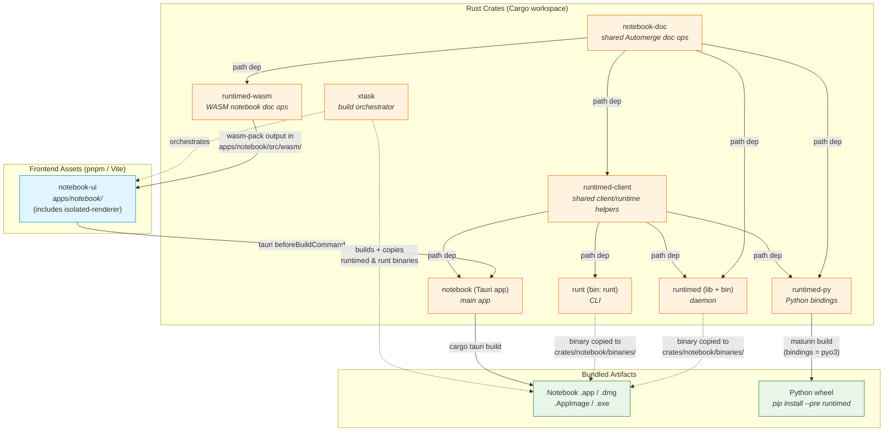
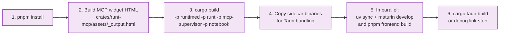
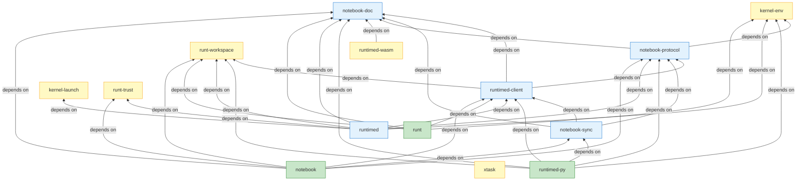

# Build & Dependency Diagram

This document shows how the crates, frontend apps, and final artifacts depend on
each other. The key insight: the Notebook app (Tauri) bundles `runtimed` and
`runt` as sidecar binaries, so those must be built **before** the Tauri bundle
step. Similarly, frontend assets must be built before their consuming Rust crates
compile.

> **Note:** `cargo xtask dev` handles the sidecar binary build automatically
> in development. For release builds the dependency chain below still applies.

## Full Build Dependency Graph

## Build Order (step by step)

The `cargo xtask build` / `cargo xtask build-app` commands automate this, but
here is what happens under the hood:

## Rust Crate Dependency Graph

Shows only the Cargo `path` dependencies between workspace members:

## Key Points

| Constraint | Why |
|---|---|
| `notebook-ui` must build before Tauri bundle | `tauri.conf.json` `beforeBuildCommand` runs `pnpm --dir apps/notebook build` |
| `runtimed` + `runt` binaries must exist in `crates/notebook/binaries/` | `tauri.conf.json` lists them in `bundle.externalBin` — Tauri bundles them into the .app/.dmg/.exe |
| `isolated-renderer` built inline | The notebook-ui Vite plugin builds the isolated renderer and embeds it as a virtual module — no separate build step needed |
| `xtask` depends on `dirs`, `runt-workspace`, `serde_json` | It shells out to `cargo build`, `pnpm`, and `cargo tauri` but also reads workspace config via `runt-workspace` and resolves paths via `dirs` |
| `runtimed-wasm` must build before `notebook-ui` | wasm-pack output lands in `apps/notebook/src/wasm/runtimed-wasm/`; Vite imports it at build time. Artifacts are committed to the repo, so this step is only needed when changing `crates/runtimed-wasm/`. |
| Python wheel uses maturin | `python/runtimed/pyproject.toml` points `maturin` at `crates/runtimed-py/Cargo.toml` with `bindings = "pyo3"` |
| `notebook-doc` is shared | `crates/notebook-doc/` provides Automerge document operations used by `runtimed`, `runtimed-wasm`, and `runtimed-py` — the single source of truth for cell mutations |
