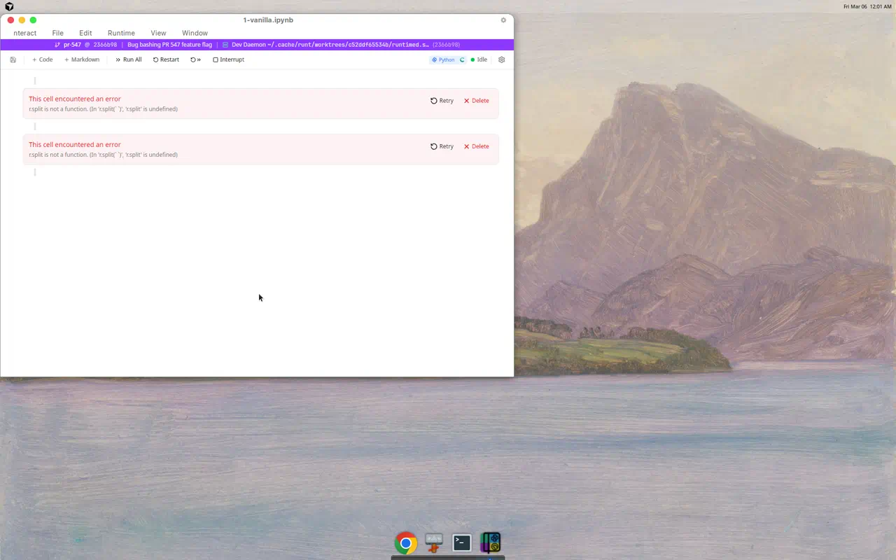
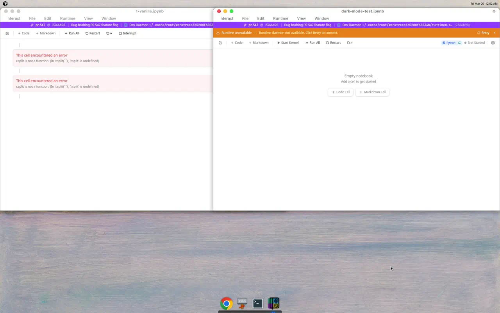
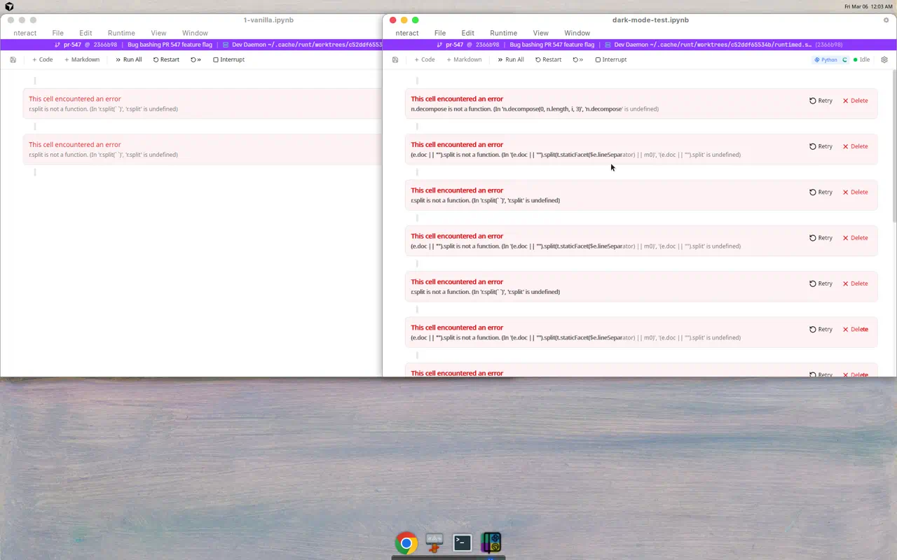
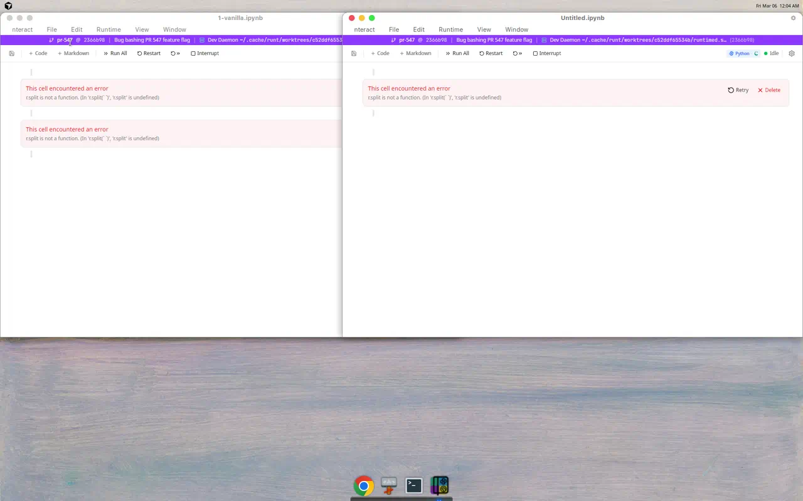

# PR 547 bug bash report

## Scope

PR: <https://github.com/nteract/desktop/pull/547>

Focus areas:

- frontend Automerge initialization
- local-first cell materialization
- add/delete cell flows
- notebook creation/loading
- buildability of the new feature-flagged path

## Test setup

1. Checked out PR 547 locally.
2. Enabled the new frontend-Automerge path for runtime testing with a local-only flag override because the flag is otherwise only reachable through webview localStorage/devtools.
3. Built the branch on Linux after:
   - installing JS dependencies with `pnpm install --frozen-lockfile`
   - working around missing OpenSSL headers in the cloud image so Rust crates could link
4. The PR as submitted still failed to build in `apps/notebook`.
5. Applied a local-only compile harness so the notebook app could launch and the Automerge path could be bug-bashed. That harness was only used to exercise runtime behavior and should not be committed.

## Summary

Confirmed bugs:

1. Build blocker: the PR does not compile as submitted.
2. Existing notebooks fail to hydrate into usable cells when the frontend Automerge path is active.
3. Creating or adding a code cell breaks the notebook and fans a single action out into multiple error cells.
4. Creating a new untitled notebook starts in a broken state.

The runtime failures are severe enough that I could not meaningfully test execution, outputs, save/save-as, or reopen flows.

## Bug 1 - Build blocker in `useAutomergeNotebook`

- Severity: P0
- Status: reproduced on the PR branch before any local compile harness

### Repro

1. Check out PR 547.
2. Install dependencies with `pnpm install --frozen-lockfile`.
3. Run the normal build.

### Observed

`cargo xtask build` fails in `apps/notebook` with TypeScript errors from the new hook:

```text
src/hooks/useAutomergeNotebook.ts(...): error TS2339: Property 'updateText' does not exist on type 'typeof import("@automerge/automerge")'.
src/hooks/useAutomergeNotebook.ts(...): error TS2339: Property 'splice' does not exist on type 'typeof import("@automerge/automerge")'.
```

### Expected

The feature-flagged path should compile cleanly even if it remains disabled by default.

### Likely root cause

`apps/notebook/src/hooks/useAutomergeNotebook.ts` imports stable `@automerge/automerge` but calls helper APIs that are exposed by Automerge's `next` surface, not the stable one. The PR therefore fails before runtime on a clean build.

## Bug 2 - Existing notebooks render as error cells instead of real cells

- Severity: P0
- Status: reproduced at runtime after applying a local compile-only harness

### Repro

1. Launch the notebook app with the frontend-Automerge flag enabled.
2. Open an existing notebook such as `1-vanilla.ipynb`.

### Observed

- The notebook window opens, but the cells render as error cards instead of code/markdown cells.
- The visible error is `r.split is not a function`.
- No usable notebook content is shown.

### Expected

Existing notebooks should materialize into normal code/markdown cells with string sources.

### Likely root cause

The frontend materializer appears to pass raw Automerge values into UI types that are declared as plain strings:

- `crates/runtimed/src/notebook_doc.rs` documents `source` as an Automerge `Text` CRDT.
- `apps/notebook/src/hooks/useAutomergeNotebook.ts` forwards `cell.source` directly from the frontend Automerge doc in `materializeCellSnapshots()`.
- `apps/notebook/src/lib/automerge-utils.ts` and `apps/notebook/src/types.ts` treat `source` as a plain `string`.

That mismatch lines up with the runtime `.split(...)` failures from the editor/rendering layer.

### Screenshots



## Bug 3 - `+ Code` on an empty notebook explodes into multiple broken cells

- Severity: P0
- Status: reproduced at runtime after applying a local compile-only harness

### Repro

1. Open an empty notebook shell that renders successfully before any cells are added.
2. Click `+ Code`.

### Observed

- Instead of a single empty code cell, the notebook fills with multiple error cells.
- I saw several JavaScript-side failures, including:
  - `...split is not a function`
  - `...decompose is not a function`
- The notebook becomes unusable immediately after the add-cell action.

### Expected

Exactly one empty code cell should be created and focused.

### Likely root cause

This flow appears to have two overlapping risks in the new hook:

1. The newly materialized cell data still appears incompatible with downstream UI code that expects plain strings.
2. `addCell()` applies a local Automerge mutation and then also fires the legacy `invoke("add_cell")` path "for legacy compatibility", which can double-apply a single user action and create conflicting state transitions.

That combination explains why a single click can fan out into several broken cells.

### Screenshots

Before clicking `+ Code`:



After clicking `+ Code`:



## Bug 4 - New untitled notebooks start broken

- Severity: P0
- Status: reproduced at runtime after applying a local compile-only harness

### Repro

1. Launch the app with the frontend-Automerge path enabled.
2. Create a new notebook via `File -> New Notebook`.

### Observed

- The new `Untitled.ipynb` window immediately shows an error cell.
- The visible error is again `...split is not a function`.
- There is no usable first cell.

### Expected

New notebooks should open with a valid empty cell ready for editing.

### Likely root cause

This appears to be the same underlying frontend materialization problem as Bug 2, triggered during notebook bootstrap for a new doc. If the initial empty cell or newly inserted cell source arrives as an Automerge object instead of a plain string, the editor/rendering code fails on first render.

### Screenshots



## Untested or blocked areas

These remained blocked by the failures above:

- editing source text
- delete-cell verification
- single-cell execution
- run all / restart and run all
- output rendering and clearing
- save/save as
- reopen/switch-back flows

## Notes

- The Rust/OpenSSL setup issue I hit on this Linux cloud image was environmental, not a PR bug.
- The build blocker in Bug 1 is from the PR as submitted.
- The runtime bugs were gathered after a local compile-only harness was applied so the notebook app could start. I would treat the runtime findings as high-confidence implementation regressions, but the exact fix should be validated on a proper compileable version of the branch before merging.
